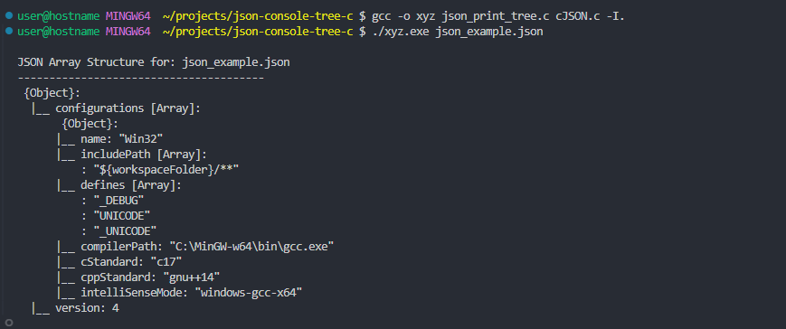

# ANSI C table formatter plugin for cJSON - transforms JSON arrays into formatted console tables

A lightweight C utility that generates formatted console tables and tree views from JSON data structures. Built on top of the cJSON library, this tool provides clean and organized visualization of JSON data directly in the terminal.

## Example

Input JSON ([`json_example.json`](json_example.json)):
```json
{
    "configurations": [
        {
            "name": "Win32",
            "includePath": [
                "${workspaceFolder}/**"
            ],
            "defines": [
                "_DEBUG",
                "UNICODE",
                "_UNICODE"
            ],
            "compilerPath": "C:\\MinGW-w64\\bin\\gcc.exe",
            "cStandard": "c17",
            "cppStandard": "gnu++14",
            "intelliSenseMode": "windows-gcc-x64"
        }
    ],
    "version": 4
}
```
## Building
- bash
   - gcc -o json_table json_print_table.c cJSON.c -I.    ./json_table [path_to_json_file]
   - gcc -o json_tree json_print_tree.c cJSON.c -I.      ./json_tree [path_to_json_file]

- Please see [`json_print_example.txt`](json_print_example.txt)

- **Two Display Modes**:
  - Table View (`json_print_table.c`): Displays JSON arrays as formatted tables
  - 
  - Tree View (`json_print_tree.c`): Shows hierarchical JSON structure
  - 

- **Table View Features**:
  - Dynamic column width adjustment
  - Smart data type formatting (currency, numbers, text)
  - Row count limits for large datasets
  - Truncation of long text fields
  - Column filters and formatting rules
  - Nested objects display as [obj]
  
- **Tree View Features**:
  - Visual hierarchy with indentation
  - Type indicators (Array, Object, String, Number)
  - Clear parent-child relationship display
  - Full depth visualization
  
## Requirements
 - C compiler (gcc recommended)
 - cJSON library (included)
 - Standard C libraries

## Limitations
  - Nested JSON structures `(nested objects display as [obj] in tables - use tree view for full depth visualization)`

## License
 - This project is licensed under the MIT License. See the [LICENSE](LICENSE) file for details.
 - cJSON library is Copyright (c) 2009-2017 Dave Gamble and cJSON contributors.
